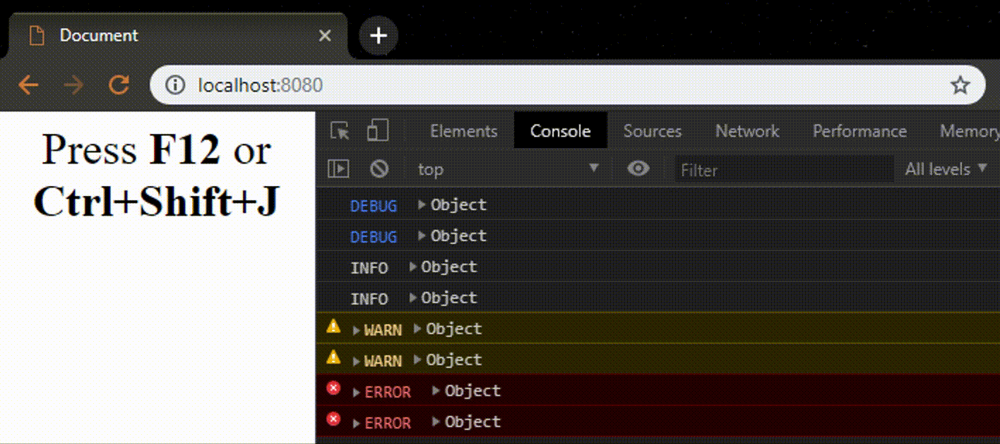

# Winston Transport BrowserConsole

Want to log in browser like using console.log but taking advantage of all facilities winston provides?

Want to filter by level in your browser?

Want to inspect the objects arguments instead of printing them as json strings?




```
npm install winston-transport-browserconsole winston -S
```

And here you have a little sample:
```javascript
import * as winston from "winston";
import BrowserConsole from 'winston-transport-browserconsole';

const level = "debug";
winston.configure({
    transports: [
        new BrowserConsole(
            {
                format: winston.format.simple(),
                level,
            },
        ),
        // Uncomment to compare with default Console transport
        // new winston.transports.Console({
        //     format: winston.format.simple(),
        //     level,
        // }),
    ],
});

winston.debug("DEBUG ", {a: 1, b: "two"});
winston.debug("DEBUG ", {a: 1, b: "two"});
winston.info("INFO ", {a: 1, b: "two"});
winston.info("INFO ", {a: 1, b: "two"});
winston.warn("WARN", {a: 1, b: "two"});
winston.warn("WARN", {a: 1, b: "two"});
winston.error("ERROR ", {a: 1, b: "two"});
winston.error("ERROR ", {a: 1, b: "two"});

winston.debug("A message alone :(  \n hahaha");
winston.debug("Here examinable Object ", {test: 'test', sub: { object : { test : "here" } } });

```


***Notice*** Tested with version 3.x.x of winston.
~~Please be sure to set the *level* in the ConsoleBrowser constructor as did not find a good way to get the one you may have directly configured in winston.~~
